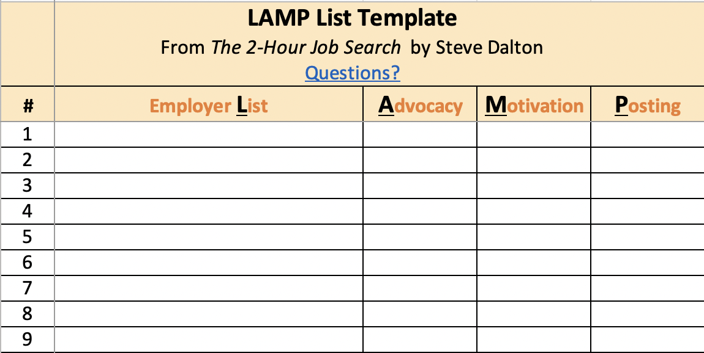

# The2MinuteJobSearch
A Python implementation of Steve Dalton's 2-Hour Job Search Method using Pandas.

*Note: this project is not affiliated with Steve Dalton or his book, and any errors are my own. Also, the views or opinions expressed in this project are solely those of the author and do not necessarily represent those of any employer, organization, committee, or other group or individual. This project is licensed under the terms of the MIT license.*


Dalton's book's method is a great way to get started with a job search. It's a simple, straightforward process that can be completed in a few hours. The method is also very flexible, allowing you to customize it to your needs.
This repository contains a Python implementation of the method using Pandas.

- [The2MinuteJobSearch](#the2minutejobsearch)
  - [Getting Started](#getting-started)
    - [Prerequisites](#prerequisites)
    - [Installing](#installing)
  - [Usage](#usage)
  - [How to Begin Your Job Search](#how-to-begin-your-job-search)
- [The Lamp DataFrame](#the-lamp-dataframe)
- [Methods](#methods)
  - [Stage One: Harvest](#stage-one-harvest)
  - [Stage Two: Contact](#stage-two-contact)
  - [Stage Three: Convince](#stage-three-convince)
  - [Stage Four: Follow-up](#stage-four-follow-up)
- [The LAMP List Generator](#the-lamp-list-generator)
- [The LAMP List](#the-lamp-list)
  - [Global Variables](#global-variables)
- [could also be as shown below](#could-also-be-as-shown-below)
  - [User-Provided Information](#user-provided-information)
  - [Programmatically Generated Information](#programmatically-generated-information)
- [(v1) Process Flow Logic](#v1-process-flow-logic)
- [The LAMP Filler Function](#the-lamp-filler-function)
- [The LAMP Harvester Function](#the-lamp-harvester-function)
- [The LAMP Harvester LinkedIn Function](#the-lamp-harvester-linkedin-function)
- [The LAMP Harvester Twitter Function](#the-lamp-harvester-twitter-function)
- [The LAMP Email Generator Function](#the-lamp-email-generator-function)
- [Acknowledgments](#acknowledgments)
- [License](#license)

---

## Getting Started

---

### Prerequisites
You will need the following installed on your machine:
- Python 3.9.6
- Pandas
- os
- datetime
- requests
- re
- bs4


### Installing

Clone the repository to your local machine:
```
git clone
```

## Usage

1. Create a new folder for your job search. This folder will contain all the files you create during your job search.
2. Generate your LAMP List. This list will contain all of the companies you want to work for. You can use the LAMP List Generator to generate your list.

## How to Begin Your Job Search
Let's start by creating a pandas dataframe that matches the template Dalton provides. This is included in this repo's data folder and is named 'template_dalton.xlsx'. Next, we will use this template to create our own dataframe.




Dalton provides compelling evidence for why randomly applying for jobs online is a "fool's errand." Dalton references a study of hiring at the New York Federal Reserve in which 12 out of every 13 jobs posted were filled through internal referrals rather than online applicants. Every career coach and nearly all successful job seekers will confirm that targeted networking is the key to securing your next job.. Additionally, many readers will appreciate the concrete approaches to networking processes, which can elude even the most personable, self-aware job seekers. His rational, flow-chart-like style eliminates the guesswork and also tempers emotional decision-making and feelings of rejection. Darden's Alumni Career Services 5-step job search model and the steps in which the 2-hour job search frameworks apply are depicted below. It would be difficult to successfully execute the "Contact" and "Convince" stages of the 2-hour job search approach if you are unclear about what you are looking for. However, if reaching out to potential employers feels awkward and overwhelming, The 2-Hour Job Search can help you start moving forward [1](https://blogs.darden.virginia.edu/careercorner/2021/03/18/the-2-hour-job-search-can-this-method-work-for-you/).


# The Lamp DataFrame

To recreate the manual process of creating a LAMP spreadsheet in Excel, we will create a pandas dataframe that matches the template Dalton provides. This is included in this repo's data folder and is named 'template_dalton.xlsx'. We will use this template to create our own dataframe.


There are several additions that we want to make to this framework.

1. Company Name
2. Company Priority to user (out of the length of total companies)
3. Company Website URL
4. Company LinkedIn URL
5. Company Twitter URL (if applicable)
6. We want to add a column for the employee's job title, `job_title`.
7. We want to add a column for the employee's LinkedIn URL `linkedin_url`.
8. We want to add a column for the employee's email address `email` if we can find it.
9.  A column that is boolean and indicates whether or not we have reached out to the employee `contacted`.
10. Another boolean column that indicates whether or not we have received a response from the employee `responded`.
11. One more boolean column for whether we are connected with this employee on LinkedIn `is_linked`.

Our dataframe will end up looking like the one below

| company_name | company_priority | company_website_url | company_linkedin_url | company_twitter_url | job_title | linkedin_url | email | contacted | responded | is_linked |
|--------------|------------------|---------------------|----------------------|---------------------|-----------|--------------|-------|-----------|-----------|-----------|
| Example Company 1 | 1 | https://example.com | https://linkedin.com/company/example-company-1 | https://twitter.com/example_company_1 | Software Engineer | https://linkedin.com/in/example-engineer |
| Example Company 2 | 2 | https://example.com | https://linkedin.com/company/example-company-2 | https://twitter.com/example_company_2 | Software Engineer | https://linkedin.com/in/example-engineer |


# Methods

## Stage One: Harvest

1. Identify ten companies you want to work for. This is your LAMP List. Next, generate your LAMP List using the LAMP List Generator.

2. Go to the company's website and identify the hiring manager's name. This can be done by searching for the company's "Careers" page or by searching for the company's "About Us" page. Once you have the hiring manager's name save the hiring manager's name and the company's name to the lamp_df dataframe.
3. Go to the company's LinkedIn page and identify the hiring manager's LinkedIn URL. Save the hiring manager's LinkedIn URL to the lamp_df dataframe.
4. Go to the hiring manager's LinkedIn page and identify the hiring manager's email address. Save the hiring manager's email address to the lamp_df dataframe.
5. Go to the hiring manager's LinkedIn page and identify the hiring manager's job title. Save the hiring manager's job title to the lamp_df dataframe.
6. (if twitter is being used) Go to the hiring manager's LinkedIn page and identify the hiring manager's Twitter URL. Save the hiring manager's Twitter URL to the lamp_df dataframe.

## Stage Two: Contact

Using the information gathered in Stage One, contact the hiring manager. You can do this by sending an email, a LinkedIn message, or a Twitter message. If you can get a response from the hiring manager, you can move on to Stage Three. If you cannot get a response from the hiring manager, you can move on to Stage Four.

1. Send a personalized message to the hiring manager. The message should be personalized to the hiring manager and should include the following:
    - A reference to a mutual connection
    - A reference to a mutual group
    - A reference to a mutual company
    - A reference to a mutual school
    - A reference to a mutual interest

data required for this message: `mutual_connection`, `mutual_group`, `mutual_company`, `mutual_school`, `mutual_interest`

2.  Send a follow-up email to the hiring manager. The email should be personalized to the hiring manager and should include the following:
    - A reference to a mutual connection
    - A reference to a mutual group
    - A reference to a mutual company
    - A reference to a mutual school
    - A reference to a mutual interest
    - A reference to a previous conversation

data required for this message: `mutual_connection`, `mutual_group`, `mutual_company`, `mutual_school`, `mutual_interest`, `previous_conversation`

## Stage Three: Convince

If you are able to get a response from the hiring manager, you can move on to Stage Three. In this stage, you will convince the hiring manager to meet with you. You can send an email, a LinkedIn message, or a Twitter message.

1. Respond to the hiring manager's response with a follow-up message. The response should be personalized to the hiring manager and should include the following:
    - A reference to a previous response
    - A compelling reason to meet with you
    - One of the following
      - A reference to a previous follow-up email
      - A question about the hiring manager's company
      - A question about the hiring manager's job
      - A request for advice

data required for this message: `previous_response`, `compelling_reason`, `previous_follow_up_email`, `question_about_company`, `question_about_job`, `request_for_advice`

## Stage Four: Follow-up

If you are not able to get a response from the hiring manager, you can move on to Stage Four. In this stage, you will follow-up with the hiring manager. You can do this by sending an email, a LinkedIn message, or a Twitter message.

1. Send a follow-up email to the hiring manager. The email should be personalized to the hiring manager and should include the following:
    - A reference to a previous conversation
    - A reference to a previous follow-up email
    - A reference to a previous response
    - A compelling reason to meet with you
    - One of the following
      - A question about the hiring manager's company
      - A question about the hiring manager's job
      - A request for advice

data required for this message: `previous_conversation`, `previous_follow_up_email`, `previous_response`, `compelling_reason`, `question_about_company`, `question_about_job`, `request_for_advice`

# The LAMP List Generator

The LAMP List Generator is a python script that will generate a LAMP List for you. The LAMP List Generator will generate a LAMP List based on the following criteria:

1. The company must have a LinkedIn page
2. The company must be on your list of companies to work for. This list is called your LAMP List.
3. The company must have a hiring manager.
   1. The hiring manager must have a LinkedIn page.
4. The hiring manager must have a job title.
5. The hiring manager must have an email address.
6. The hiring manager must have a Twitter page (if you are using Twitter).

Once the data for the section has been gathered from the user, the LAMP List Generator will generate a LAMP List for you. In addition, the LAMP List Generator will generate a LAMP dataframe in pandas which will be saved as a pickle file for later use.

# The LAMP List

So, what is the lamp list? You (the user) define your top 10 companies that you want to work for. The LAMP List Generator will then generate a LAMP List for you. The LAMP List will contain the following information:

## Global Variables
"`python
linkedin_hiring_managersearch_pattern = f"https://www.linkedin.com/search/results/people/?facetCurrentCompany=%5B%22{company_id}%22%5D&facetGeoRegion=%5B%22us%3A0%22%5D&keywords={hiring_manager_name}&origin=FACETED_SEARCH"

# could also be as shown below
pattern_2 = f'https://www.linkedin.com/company/{company_name}/people/?keywords=hiring%20manager'


## User-Provided Information
1. Company Name
2. Company Priority (1-10)

## Programmatically Generated Information
3. Company Website URL (if available)
4. Company LinkedIn URL (if available)
5. Company Twitter URL (if available)
6. Hiring Manager Name (if available)
7. Hiring Manager LinkedIn URL (if available)
8. Hiring Manager Email Address (if available)


# (v1) Process Flow Logic

**The logic outlined below is to be used for the v1 of the LAMP List Generator and is subject to change.**

1. User provides input to the LAMP List Generator.
2. The LAMP List Generator file uses the input to generate a LAMP List which is saved as `lamp_list.csv` in the data folder.
3. The LAMP List Generator python script `lamp_list_gen.py` reads the `lamp_list.csv` file and generates a LAMP dataframe `lamp_df`, which is saved as `lamp_df.pkl` in the data folder.
4. The lamp dataframe is unpopulated at this stage, and so we call the `lamp_filler` function in `functions.py` to populate the lamp dataframe with the data that we already have from step(s) 1-2.
5. The `lamp_filler` function calls the `lamp_harvester` function in `functions.py` to harvest the data we need to fill the lamp dataframe from the LinkedIn and Twitter APIs.
6. The `lamp_harvester` function calls the `lamp_harvester_linkedin` function in `functions.py` to harvest the data that we need to fill the lamp dataframe from the LinkedIn API specifically.
7. The `lamp_harvester_linkedin` function opens a Chrome browser and uses Selenium to navigate to the LinkedIn page of the hiring manager and harvest the data that we need to fill the lamp dataframe.
8. The `lamp_harvester` function calls the `lamp_harvester_twitter` function in `functions.py` to harvest the data that we need to fill the lamp dataframe from the Twitter API specifically.
9. The `lamp_harvester_twitter` function opens a Chrome browser and uses Selenium to navigate to the Twitter page of the hiring manager and harvest the data that we need to fill the lamp dataframe.
10. The `lamp_filler` function calls the `lamp_cleaner` function in `functions.py` to clean the data that we harvested from the LinkedIn and Twitter APIs.
11. The `lamp_cleaner` function calls the `lamp_cleaner_linkedin` function in `functions.py` to clean the data we harvested from the LinkedIn API.
12. The `lamp_cleaner` function calls the `lamp_cleaner_twitter` function in `functions.py` to clean the data we harvested from the Twitter API.
13. The `lamp_filler` function calls the `lamp_saver` function in `functions.py` to save the lamp dataframe to the data folder as `lamp_df.pkl`.
14. The `lamp_saver` function saves the lamp dataframe to the data folder as `lamp_df.pkl`.
15. The `lamp_filler` function calls the `lamp_sender` function in `functions.py` to send the messages to the hiring managers.
16. The `lamp_sender` function calls the `lamp_sender_linkedin` function in `functions.py` to send messages to the hiring managers through LinkedIn specifically.
17. The `lamp_sender` function calls the `lamp_sender_twitter` function in `functions.py` to send the messages to the hiring managers through Twitter specifically.
18. The `lamp_sender` function calls the `lamp_sender_email` function in `functions.py` to send the messages to the hiring managers through email specifically.
19. The `lamp_sender_email` function uses the `smtplib` library to send the messages to the hiring managers through email.
20. The `lamp_sender` function calls the `lamp_sender_text` function in `functions.py` to generate the message text. The message text is then added to the email message.
21. The `lamp_sender` function calls the `lamp_sender_subject` function in `functions.py` to generate the message subject. Finally, the message subject is added to the email message.
22. The `lamp_sender` function calls the `lamp_sender_attachment` function in `functions.py` to generate the message attachment. Finally, the message attachment is added to the email message.
23. The `lamp_sender` function calls the `lamp_sender_signature` function in `functions.py` to generate the message signature. The message signature is added to the email message.
24. The `lamp_sender` function calls the `lamp_sender_footer` function in `functions.py` to generate the message footer. The message footer is added to the email message.
25. The `lamp_sender` function calls the `lamp_sender_greeting` function in `functions.py` to generate the message greeting. Finally, the message greeting is added to the email message.
26. The `lamp_sender` function calls the `lamp_sender_body` function in `functions.py` to generate the message body. This is usually just the message text. The message body is added to the email message.
27. Time to send the message! The `lamp_sender` function calls the `lamp_sender_email` function in `functions.py` to send the messages to the hiring managers through email specifically. We will use the python Gmail library `smtplib` to send the email.
28. The `lamp_sender_email` function uses the `smtplib` library to send the messages to the hiring managers through email.
29. The `lamp_sender` function calls the `lamp_sender_text` function in `functions.py` to send the messages to the hiring managers through text specifically. We will use the python Twilio library `twilio` to send the text.
30. The `lamp_sender_text` function uses the `twilio` library to send the messages to the hiring managers through text.
31. The `lamp_sender` function calls the `lamp_sender_linkedin` function in `functions.py` to send the messages to the hiring managers through LinkedIn specifically. We will use the python linkedin library `linkedin` to send the LinkedIn message.


# The LAMP Filler Function

The LAMP Filler function is a function that will fill the LAMP dataframe with the data that we already have from step(s) 1-2. The LAMP Filler function will fill the LAMP dataframe with the following information:

# The LAMP Harvester Function

The LAMP Harvester function is a function that will harvest the data that we need to fill the LAMP dataframe from the LinkedIn and Twitter APIs. The LAMP Harvester function will harvest the data that we need to fill the LAMP dataframe with the following information:


# The LAMP Harvester LinkedIn Function

The LAMP Harvester LinkedIn function is a function that will harvest the data that we need to fill the LAMP dataframe from the LinkedIn API specifically. The LAMP Harvester LinkedIn function will harvest the data that we need to fill the LAMP dataframe with the following information:

1. Company Website URL (if available)
2. Company LinkedIn URL (if available)
3. Company Twitter URL (if available)
4. Hiring Manager Name (if available)
5. Hiring Manager LinkedIn URL (if available)
6. Hiring Manager Email Address (if available)


# The LAMP Harvester Twitter Function

The LAMP Harvester Twitter function is a function that will harvest the data that we need to fill the LAMP dataframe from the Twitter API specifically. The LAMP Harvester Twitter function will harvest the data that we need to fill the LAMP dataframe with the following information:

1. Company Website URL (if available)
2. Company LinkedIn URL (if available)
3. Company Twitter URL (if available)
4. Hiring Manager Name (if available)
5. Hiring Manager LinkedIn URL (if available)
6. Hiring Manager Email Address (if available)

# The LAMP Email Generator Function

The LAMP Email Generator function is a function that will generate a LAMP Email for you. The LAMP Email Generator function will generate a LAMP Email based on the following criteria:

1. The company must have a LinkedIn page
2. The company must be on your list of companies to work for. This list is called your LAMP List.
3. The company must have a hiring manager.
   1. The hiring manager must have a LinkedIn page.
4. The hiring manager must have a job title.
5. The hiring manager must have an email address.
6. The hiring manager must have a Twitter page (if you are using Twitter).

Once the data for the section has been gathered from the user, the LAMP Email Generator will generate a LAMP Email for you. The LAMP Email Generator will generate a LAMP dataframe in pandas which will be saved as a pickle file for later use.


# Acknowledgments
Steve Dalton's book, The 2-Hour Job Search, is a highly valuable resource for job seekers. I highly recommend it to anyone looking for a job. https://2hourjobsearch.com/

# License
This project is licensed under the MIT License.